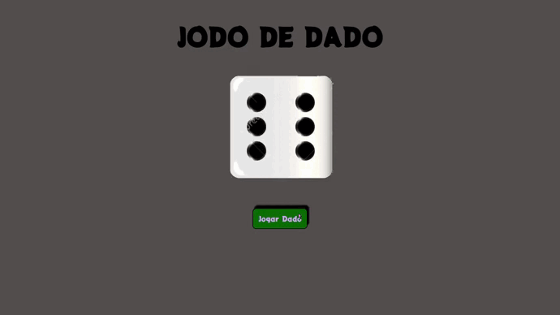

# Array Cartas
## Utilizando array para printar cartas na tela

# Contador

# Dado
## Switch case

# Jokenpo
## Encadeamento das estruturas condicionais

# Lampada
## Encadeamento das estruturas condicionais

