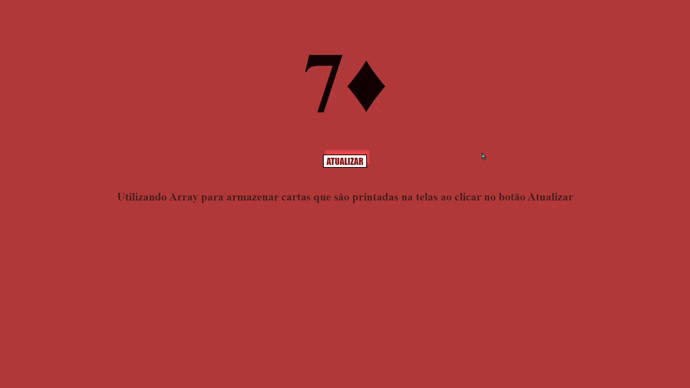
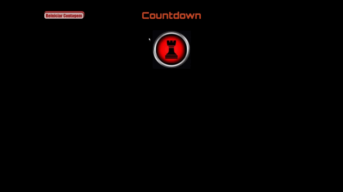
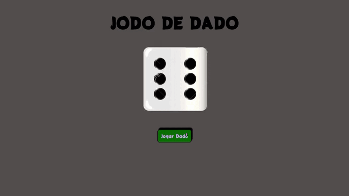
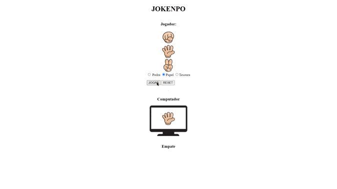
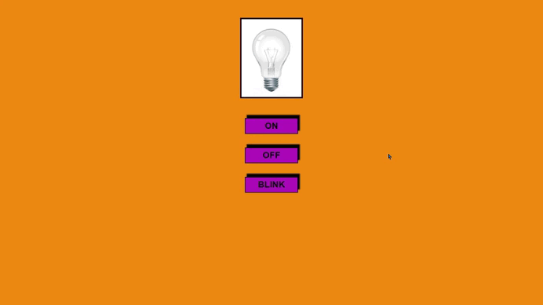

# Array Cartas
### Utilizando array para printar cartas na tela

# Contador
### Eventos de sincronização e reprodução de arquivos de audio usando JavaScript

# Dado
###  Utilizando Switch case

# Jokenpo
### Utilizando Encadeamento das estruturas condicionais

# Lampada

